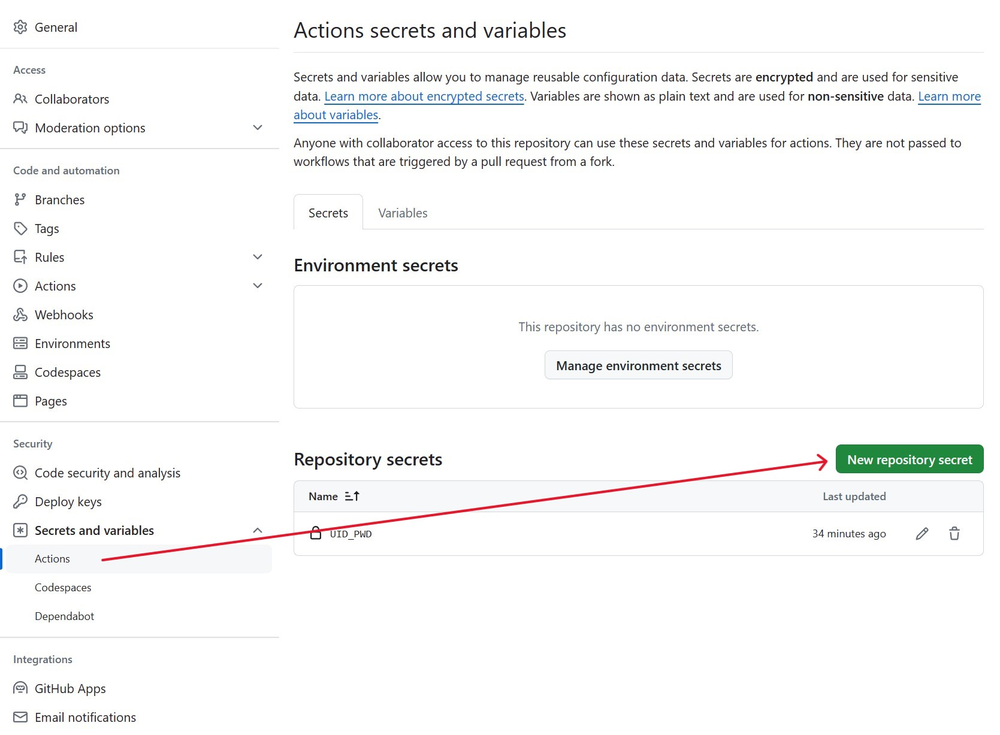
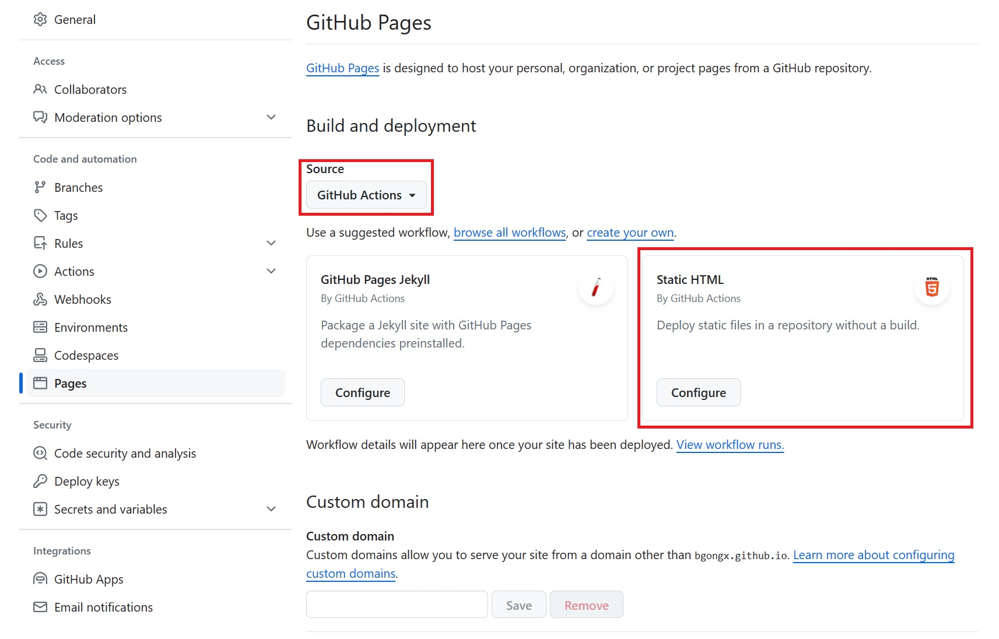

# gatepasscode
郑州大学主校区入校通行码，适配北门、东门、南门。
## Update
本项目的secrets变量仅需`UID_PWD`。
### 本人其他相关项目
* [郑州大学空教室查询](https://github.com/TorCroft/ZZU-ClassRoom)，查询特定教学楼空教室。
* [郑州大学移动校园API](https://github.com/TorCroft/ZZU-API)，提供空教室查询、成绩查询、课表查询等服务。
### 预览


## Usage
* 创建一个空仓库

* 添加名为`UID_PWD`的secrets变量。定位到Settings -> Secrets and variables -> Actions，选择New repository secret（绿色的按钮）。`UID_PWD`：账号密码都是健康打卡平台的，将你的账号密码使用`&`拼接起来。<br>Exp: 你的账号是123456789，密码是password，那么`UID_PWD`的值应该是`123456789&password`，密码默认是身份证后八位。用于Python脚本爬取新的通行码图片。
<br>

* 使用Github Action老部署静态HTML网页。定位到 Settings  -> Pages，在 Build and deployment 一栏中，Source 选择`Github Actions`，然后选择`Static HTML`。<br><br>要指定的yml设置为如下内容

``` yaml
name: Deploy GatePasscode

on:
  workflow_dispatch:

concurrency:
  group: "pages"
  cancel-in-progress: false

jobs:
  build:
    runs-on: ubuntu-latest
    permissions: write-all
    steps:
      - name: Checkout
        uses: actions/checkout@v4

      - name: Set up Python 3.12
        uses: actions/setup-python@v5
        with:
          python-version: 3.12

      - name: Install dependencies
        run: |
          python -m pip install --upgrade pip
          git clone --depth 1 https://github.com/TorCroft/gatepasscode.git
          requirements_file="./gatepasscode/requirements.txt"
          if [ -f $requirements_file ]; then pip install -r $requirements_file; fi

      - name: Run Python Script
        env:
          UID_PWD: ${{ secrets.UID_PWD }}
        run: |
          cd gatepasscode
          python ./index.py

      - name: Setup Pages
        uses: actions/configure-pages@v4

      - name: Upload artifact
        uses: actions/upload-pages-artifact@v3
        with:
          path: "./gatepasscode/page"

  deploy:
    needs: build
    permissions:
      pages: write
      id-token: write
    environment:
      name: github-pages
      url: ${{ steps.deployment.outputs.page_url }}
    runs-on: ubuntu-latest
    steps:
      - name: Deploy to GitHub Pages
        id: deployment
        uses: actions/deploy-pages@v4
```
### 注意
* GitHub Action的触发器中不再包含定时器，本人只在需要时运行Action更新通行码图片。iOS可使用[Shortcuts](https://apps.apple.com/app/shortcuts/id915249334) APP，利用API触发。这里给出示例 [API触发Workflow](https://github.com/TorCroft/gatepasscode/blob/main/How-to-Run-Workflow-via-API.md) ，示例中包含使用Python和Shortcuts请求API触发Workflow。
* 如需要定时器，请自行在 Workflow 中的`on`添加以下代码
``` yaml
  schedule:
    - cron: '0 20 * * *'
```
修改后为
``` yaml
on:
  # 手动触发入口
  workflow_dispatch:
  # 定时器，UTC时间每天的20:00
  schedule:
    - cron: '0 20 * * *'
```
